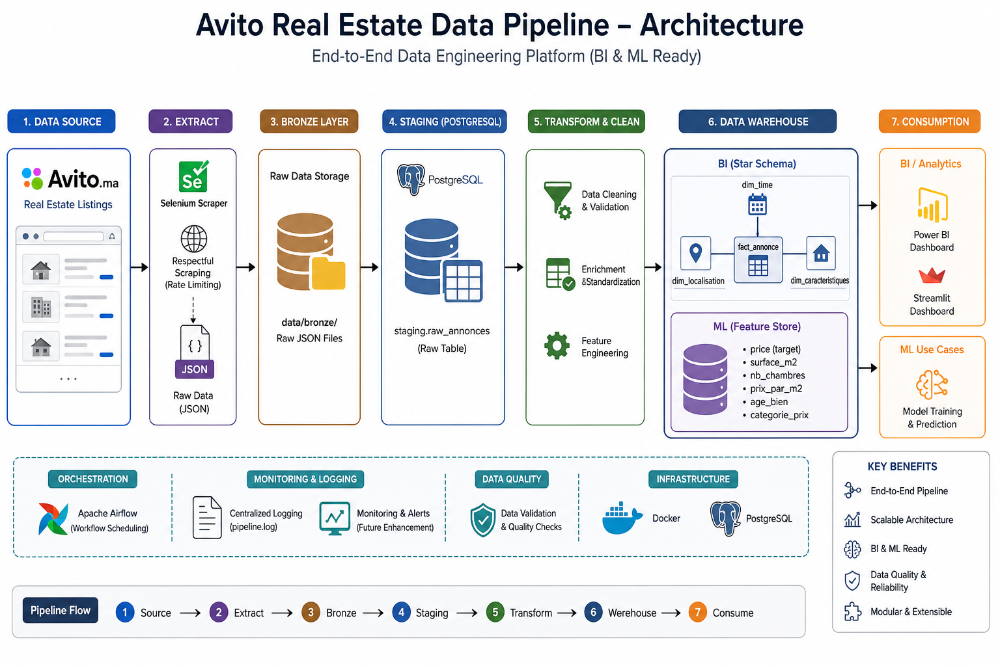

# 🚀 Avito Real Estate Data Pipeline


End to end data engineering project that transforms raw real estate listings from **Avito.ma** into analytics ready datasets and machine learning features.

## 🔗 Project Evolution

This repository is the evolved implementation of my Avito real estate data engineering project.

The earlier version is preserved in [real-estate-data-pipeline](https://github.com/badre2152/real-estate-data-pipeline), where the initial Selenium, PostgreSQL, dimensional modeling, BI, and ML feature store workflow was developed.

This repository builds on that foundation with a more mature project structure, broader automation, documentation, and testing. The two repositories are intentionally linked so the progression is clear.
---
## ⚠️ Disclaimer

This project is for educational purposes only.  
No personal data is collected or stored.  
Scraping is performed on publicly available listings with respectful rate limiting.
and all the data will not be shared and will be deleted within 2 weeks


## 📄 License
This project is licensed under the MIT License.
---

## 🎯 Project Overview

This project simulates a **production-grade data pipeline**:

* Extracts real estate listings via web scraping
* Processes and cleans raw data
* Loads structured data into a PostgreSQL Data Warehouse
* Serves analytics (BI) and Machine Learning use cases

---

## 🧱 Architecture



**Flow:**

```
Selenium Scraper
      ↓
Bronze Layer (JSON)
      ↓
PostgreSQL Staging
      ↓
Cleaning & Feature Engineering
      ↓
Data Warehouse (Star Schema)
      ↓
Power BI Dashboard
      ↓
ML Feature Store (OBT)
```

---

## 🛠️ Tech Stack

* **Python** → ETL & scraping
* **Selenium** → Data extraction
* **PostgreSQL** → Data warehouse
* **SQL** → Transformations & analytics
* **Docker** → Environment orchestration
* **Streamlit / Power BI** → Data visualization

---

## 📊 Business Use Cases

* Track real estate price trends across cities
* Compare price per m² by location
* Identify high-value investment zones
* Build ML models for price prediction

---

## 🗂️ Project Structure

```
data_pipeline/
├── data/
│   ├── bronze/        # Raw JSON data
│   ├── silver/        # Cleaned CSV data
│   └── gold/          # Final outputs (BI/ML)
├── logs/
│   └── pipeline.log
├── src/
│   ├── extract/
│   ├── staging/
│   ├── clean/
│   ├── warehouse/
|   ├── tests/
│   ├── utils/
│   └── pipeline.py
├── docs/
├── docker-compose.yml
├── Dockerfile
├── requirements.txt
└── .env
```

---

## 🏗️ Data Warehouse Design

### Schemas

| Schema    | Purpose                   |
| --------- | ------------------------- |
| staging   | Raw temporary data        |
| clean     | Cleaned + enriched data   |
| bi_schema | Star schema for analytics |
| ml_schema | Feature store (ML)        |

### ⭐ Star Schema (BI)

```
fact_annonce
   ├── dim_localisation
   ├── dim_caracteristiques
   └── dim_temps
```

### 🤖 Feature Store (ML)

```
feature_store
→ prix (target)
→ surface_m2
→ nb_chambres
→ prix_par_m2
→ age_bien 
+ > ⚠️ **Limitation:** `age_bien` is derived from `annee_construction`.

+ > This field has **0% fill rate** — Avito does not expose it in the listing HTML.

+ > ML models should not rely on `age_bien` until a data source is found.
→ categorie_prix
```

---

## 🔄 Pipeline Workflow

```
run_scraper()        → bronze/*.json
run_staging()        → staging.raw_annonces
run_clean()          → clean.annonces
run_bi_schema()      → bi_schema tables
run_ml_schema()      → ml_schema.feature_store
_cleanup_staging()   → cleanup
```

---

## ⚙️ Engineering Highlights

* Idempotent data loading (`ON CONFLICT DO NOTHING`)
* Retry mechanism (3 attempts)
* Modular pipeline design
* Centralized logging system
* Data validation & type handling

---

## 🐳 Setup & Installation

### 1. Clone repository

```bash
git clone https://github.com/badre2152/real-estate-pipeline.git
cd real-estate-pipeline
```

### 2. Setup environment

```bash
python -m venv venv
source venv/bin/activate
pip install -r requirements.txt

Check that Great Expectations is installed (required to run the pipeline)

```

### 3. Configure environment

Create a local `.env` file from the tracked template:

```bash
cp .env.example .env
```

Then replace `change_me_database_password` with your PostgreSQL password.

```dotenv
DB_HOST=localhost
DB_PORT=5433
DB_NAME=avito_db
DB_USER=postgres
DB_PASSWORD=change_me_database_password
```

For Docker execution, Compose overrides only `DB_HOST` and `DB_PORT` inside the pipeline container to use `postgres:5432`. This keeps the same `.env` usable for host tools and local Python execution.

---

## 🚀 Run the Pipeline

### Using Docker

```bash
docker compose up --build
```

### Local execution

```bash
docker compose up postgres -d
python src/pipeline.py
```

---

## 📊 Dashboard Preview


---

## 🔗 Related Projects

Ce pipeline alimente directement le dashboard BI suivant :

| Repo | Rôle | Lien |
|------|------|------|
| ⚙️ **real-estate-pipeline** *(ce repo)* | Upstream — Scraping → ETL → PostgreSQL | — |
| 📊 **avito-dashboards-and-repports** | Downstream — Power BI Dashboards & Reports | [badre2152/avito-dashboards-and-repports](https://github.com/badre2152/avito-dashboards-and-repports) |

```
real-estate-pipeline
    └──> PostgreSQL (bi_schema)
              └──> avito-dashboards-and-repports
```

> The dashboard repo consumes the `bi_schema` tables produced by this pipeline.

---

## 🔌 Power BI Integration

1. Connect to PostgreSQL 
> ⚠️ Note: Docker maps PostgreSQL to port **5433** (not the default 5432).
> Use `localhost:5433` when connecting from Power BI or any external tool.
2. Import `bi_schema` tables
3. Use relationships for analysis

---

## 🧪 Testing (Optional)

```bash
pytest
```

---

## 🛡️ Data Ethics & Compliance

* No personal data collected
* Only public listings used
* Respectful scraping (rate limiting)
* Full pipeline logging

---

## 🧠 Why This Project Stands Out

* Implements **Medallion Architecture (Bronze/Silver/Gold)**
* Separates **BI and ML workloads**
* Uses **Star Schema** for analytics
* Includes **Feature Store for ML**
* Designed like a real-world data platform

---

## 👤 Author

**BRAHIM BADRE** – Data Engineering & Analytics Enthusiast

---

## ⭐ Support

If you found this project useful, consider giving it a star ⭐